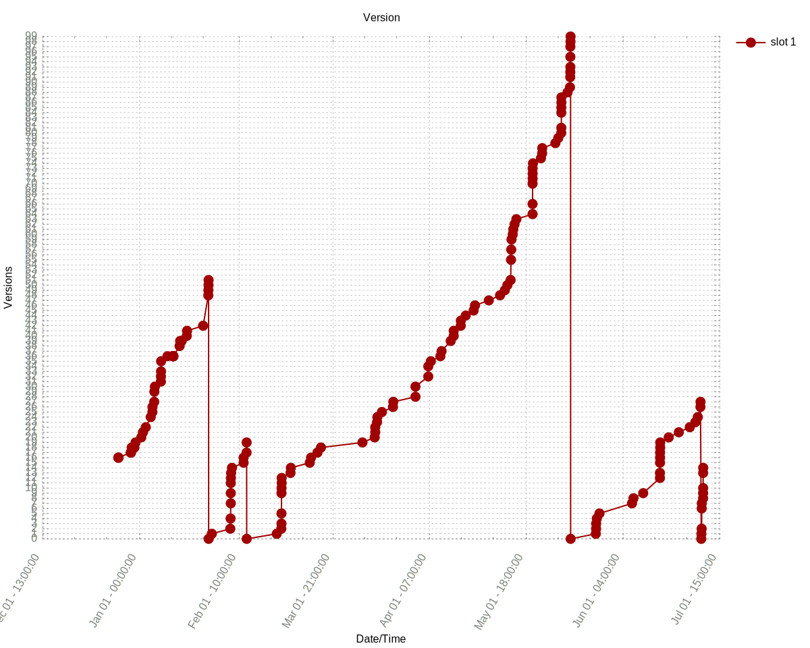

# Current Version

MCVER=1.15.2

FORGEVER=31.1.16

# Changes
Build: 1.15.2-31.1.16 - Mon Feb 24 03:17:00 GMT 2020  
	cpw:  
		Fix up alarming security crisis with network handling that allowed for wrong code execution on the server, resulting in CRASHED SERVERS. AWFUL stuff.  
		  
		Also fixed a silly log message from the login handler.  
		  
		This change introduces a mechanism to direct certain packets to only process on one side or another. Invalid sidedness will result in the connection being terminated.  
		  
		Signed-off-by: cpw <cpw+github@weeksfamily.ca>  
  
# History

  

This graph watch only "update" commits from AutoUpdater, any other commit will be ignored.

# Usage
If u want to update this repo without running the `actions` use `skip-ci` in the commit description. (ps. wont work in the `extended descrription`)  
