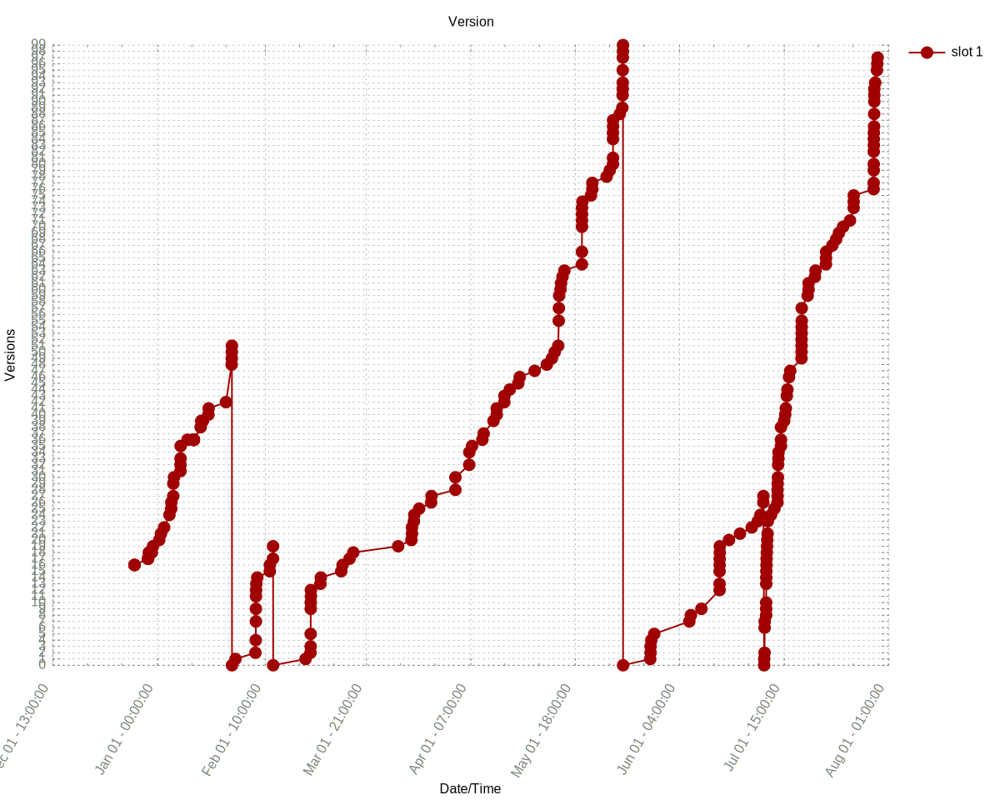

# Current Version

MCVER=1.15.2

FORGEVER=31.1.71

# Changes
Build: 1.15.2-31.1.71 - Sun May 03 20:34:34 GMT 2020  
	richard:  
		Fixed Hoppers not inserting fully into custom contains with slots that can hold more then max stack (#6631)  
  
# History

  

This graph watch only "update" commits from AutoUpdater, any other commit will be ignored. 

# Usage
If u want to update this repo without running the `actions` use `skip-ci` in the commit description. (ps. wont work in the `extended descrription`)  
